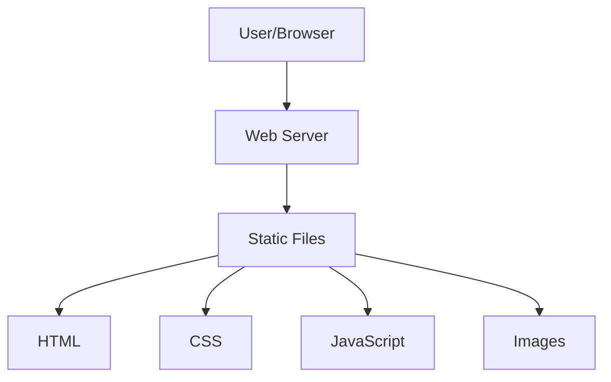
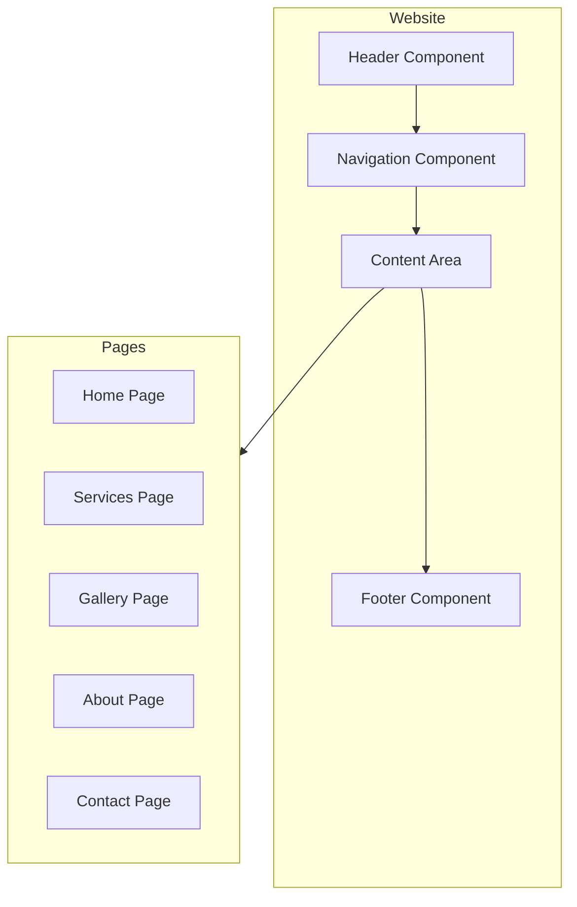

# System Patterns: Vaughans Upholstery Website

## System Architecture
The Vaughans Upholstery website will use a simple, static website architecture:



## Key Technical Decisions

### 1. Static Site Approach
- **Decision**: Use a static site without a backend or database
- **Rationale**: 
  - Simplifies development and maintenance
  - Reduces hosting costs
  - Improves performance and security
  - Meets all current requirements without unnecessary complexity

### 2. Responsive Design
- **Decision**: Mobile-first responsive design using CSS flexbox/grid
- **Rationale**:
  - Ensures optimal viewing experience across all devices
  - Follows modern web development best practices
  - Improves SEO and user experience

### 3. Minimal JavaScript
- **Decision**: Use minimal JavaScript, only where necessary for enhanced user experience
- **Rationale**:
  - Improves page load times
  - Reduces complexity
  - Ensures functionality for users with JavaScript disabled

### 4. Image Optimization
- **Decision**: Optimize all images for web use
- **Rationale**:
  - Improves page load times
  - Reduces bandwidth usage
  - Enhances user experience

## Design Patterns

### Component-Based Structure
- Header, navigation, footer, and other UI elements will be designed as reusable components
- Consistent styling across pages
- Modular CSS approach

### Progressive Enhancement
- Core content and functionality available to all users
- Enhanced features added for modern browsers
- Graceful degradation for older browsers

## Component Relationships



## File Structure
```
vaughans-upholstery/
├── index.html
├── services.html
├── gallery.html
├── about.html
├── contact.html
├── css/
│   ├── styles.css
│   └── normalize.css
├── js/
│   └── main.js
└── images/
    ├── logo.png
    ├── hero-images/
    └── gallery/
```

## Coding Standards
- HTML5 semantic markup
- CSS3 with modern features (flexbox, grid, variables)
- ES6+ JavaScript (minimal usage)
- Consistent indentation and naming conventions
- Mobile-first media queries
